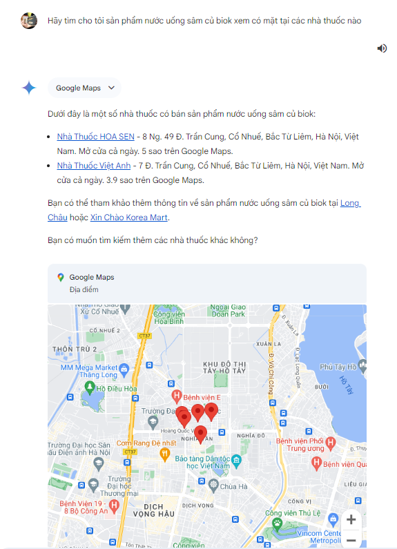
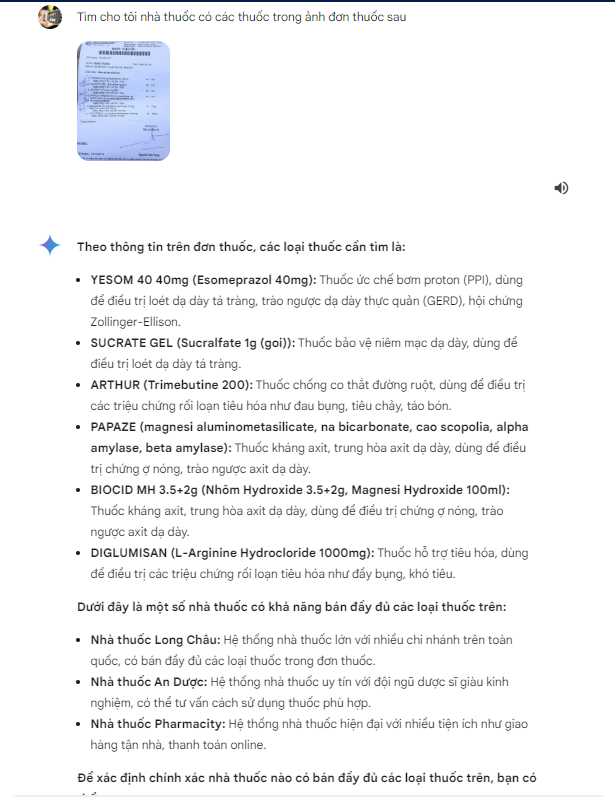
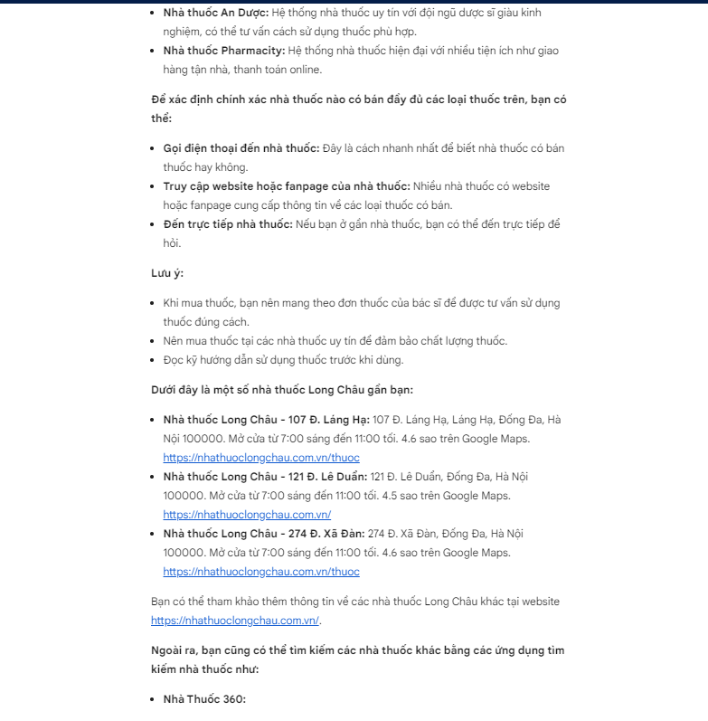
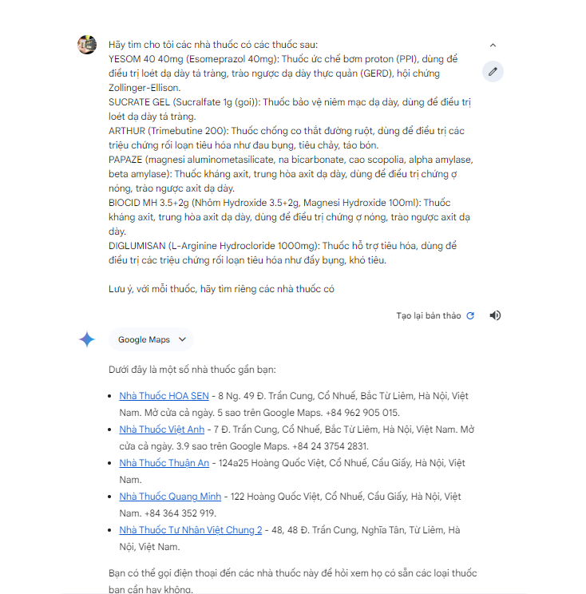

# Introduction

I have some experiences that some drug in the hospital's prescription do not appear in the hospital pharmacy. Then i have to searching so much both online and offline to find out which pharmacy has that drugs for me. So i build a project with the following purpose

- Using OCR for extract drug information from prescription
- From the result above, then i will make a system that can find the best list of pharmacy that suitable for me with property:
    * Nearby
    * Drugs available
    * Reasonable price

## Related Methods

### End2End with gemini

I found that the Gemini has fully the system flow like I want. It can extract the informations from the prescristion image, tracking current user location, then in someway that i dont know (maybe it is the combination of google search and google map to find the drug store nearby)

There is a example that i try:

The results come with suprise. But I still want to making my own tools that can do the same and more helpful because really want to know how can Gemini from Google do that. No need to be exactly what Google dot but i want to re-implement about 90% like that in flow and more accurately.

I say more accurately because what Gemini do is very general, You can find more thing than just the drug stores that have what you want. So if I just focus on that specific task, maybe i can do better.

For example above, Gemini can find out exactly the store i want, it just suggest. I try to change the prompt for wanted results but it not give me what i want.

